# 数据结构与算法

线性表是逻辑结构，顺序表和链表是存储结构

复习建议：直接看题

[卷子](卷子 3784c1360edb4e499e898eec06876358.md)

如果你想搜索某个内容，请使用浏览器的搜索功能（Ctrl+F），notion 自带的不好使

## 目录🧭（点击跳转）

[时间复杂度](%E6%95%B0%E6%8D%AE%E7%BB%93%E6%9E%84%E4%B8%8E%E7%AE%97%E6%B3%95%20dc82eb78903d4bd093174a6a60aabbe7.md),[题目](题目 d94c093bc7af4de2aff9c7e5356fbaa9.md) 

[线性表](%E6%95%B0%E6%8D%AE%E7%BB%93%E6%9E%84%E4%B8%8E%E7%AE%97%E6%B3%95%20dc82eb78903d4bd093174a6a60aabbe7.md)

[定义](%E6%95%B0%E6%8D%AE%E7%BB%93%E6%9E%84%E4%B8%8E%E7%AE%97%E6%B3%95%20dc82eb78903d4bd093174a6a60aabbe7.md)，[题目](题目 782a88aafaa14186bb7e860541de1d2b.md) 

[顺序表](%E6%95%B0%E6%8D%AE%E7%BB%93%E6%9E%84%E4%B8%8E%E7%AE%97%E6%B3%95%20dc82eb78903d4bd093174a6a60aabbe7.md)，[题目](题目 4fa03496953947d8892eb24d134fd82c.md) 

[链表](%E6%95%B0%E6%8D%AE%E7%BB%93%E6%9E%84%E4%B8%8E%E7%AE%97%E6%B3%95%20dc82eb78903d4bd093174a6a60aabbe7.md)，[题目](题目 3731afee99414eba852fe2a020fade00.md) 

[栈](%E6%95%B0%E6%8D%AE%E7%BB%93%E6%9E%84%E4%B8%8E%E7%AE%97%E6%B3%95%20dc82eb78903d4bd093174a6a60aabbe7.md)，[题目](题目 0b1c8314247a472f8eeb460f683ca1d8.md) 

[队列](%E6%95%B0%E6%8D%AE%E7%BB%93%E6%9E%84%E4%B8%8E%E7%AE%97%E6%B3%95%20dc82eb78903d4bd093174a6a60aabbe7.md)，[题目](题目 2b2a2772d43f4e09912b5cced62bb00b.md) 

[特殊矩阵](%E6%95%B0%E6%8D%AE%E7%BB%93%E6%9E%84%E4%B8%8E%E7%AE%97%E6%B3%95%20dc82eb78903d4bd093174a6a60aabbe7.md)，[题目](题目 2797429a883842e98f6084e0080551eb.md) 

[串](%E6%95%B0%E6%8D%AE%E7%BB%93%E6%9E%84%E4%B8%8E%E7%AE%97%E6%B3%95%20dc82eb78903d4bd093174a6a60aabbe7.md)，[题目](题目 cc31d14c2eb949c2a0e1f2a129caec29.md) 

[树](%E6%95%B0%E6%8D%AE%E7%BB%93%E6%9E%84%E4%B8%8E%E7%AE%97%E6%B3%95%20dc82eb78903d4bd093174a6a60aabbe7.md)

[树的概念和性质](%E6%95%B0%E6%8D%AE%E7%BB%93%E6%9E%84%E4%B8%8E%E7%AE%97%E6%B3%95%20dc82eb78903d4bd093174a6a60aabbe7.md)，[题目](题目 552b767fa32f4366afe6de00d26c9b0e.md) 

[二叉树](%E6%95%B0%E6%8D%AE%E7%BB%93%E6%9E%84%E4%B8%8E%E7%AE%97%E6%B3%95%20dc82eb78903d4bd093174a6a60aabbe7.md)，[题目](题目 6f8b90cbd5aa4bd4a46d425643c09b01.md) 

[二叉树的遍历](%E6%95%B0%E6%8D%AE%E7%BB%93%E6%9E%84%E4%B8%8E%E7%AE%97%E6%B3%95%20dc82eb78903d4bd093174a6a60aabbe7.md)，[题目](题目 74e1f1e6a5b6437d822f3319b269cbc1.md) 

[线索二叉树](%E6%95%B0%E6%8D%AE%E7%BB%93%E6%9E%84%E4%B8%8E%E7%AE%97%E6%B3%95%20dc82eb78903d4bd093174a6a60aabbe7.md)，[题目](题目 d12e7bff89ea48fdbbf5f25db6977edd.md) 

[树的存储结构](%E6%95%B0%E6%8D%AE%E7%BB%93%E6%9E%84%E4%B8%8E%E7%AE%97%E6%B3%95%20dc82eb78903d4bd093174a6a60aabbe7.md)

[树、森林、二叉树的转化](%E6%95%B0%E6%8D%AE%E7%BB%93%E6%9E%84%E4%B8%8E%E7%AE%97%E6%B3%95%20dc82eb78903d4bd093174a6a60aabbe7.md)

[树和森林的遍历](%E6%95%B0%E6%8D%AE%E7%BB%93%E6%9E%84%E4%B8%8E%E7%AE%97%E6%B3%95%20dc82eb78903d4bd093174a6a60aabbe7.md)，[题目](题目 28c75b82542c42a4bacae799bde3599a.md) 

[哈夫曼树](%E6%95%B0%E6%8D%AE%E7%BB%93%E6%9E%84%E4%B8%8E%E7%AE%97%E6%B3%95%20dc82eb78903d4bd093174a6a60aabbe7.md)，[题目](题目 39aba94ddb4045659159e167cb7dc8da.md) 

[并查集](%E6%95%B0%E6%8D%AE%E7%BB%93%E6%9E%84%E4%B8%8E%E7%AE%97%E6%B3%95%20dc82eb78903d4bd093174a6a60aabbe7.md)，

[图](%E6%95%B0%E6%8D%AE%E7%BB%93%E6%9E%84%E4%B8%8E%E7%AE%97%E6%B3%95%20dc82eb78903d4bd093174a6a60aabbe7.md)

[图的概念和性质](%E6%95%B0%E6%8D%AE%E7%BB%93%E6%9E%84%E4%B8%8E%E7%AE%97%E6%B3%95%20dc82eb78903d4bd093174a6a60aabbe7.md)，[题目](题目 b3d17e618bdf4bafaa20287c16a5a668.md) 

[图的存储](%E6%95%B0%E6%8D%AE%E7%BB%93%E6%9E%84%E4%B8%8E%E7%AE%97%E6%B3%95%20dc82eb78903d4bd093174a6a60aabbe7.md)和[基本操作](%E6%95%B0%E6%8D%AE%E7%BB%93%E6%9E%84%E4%B8%8E%E7%AE%97%E6%B3%95%20dc82eb78903d4bd093174a6a60aabbe7.md)，[题目](题目 25b98965f14f4ab0857d73fdc9e1ac04.md) 

[图的遍历](%E6%95%B0%E6%8D%AE%E7%BB%93%E6%9E%84%E4%B8%8E%E7%AE%97%E6%B3%95%20dc82eb78903d4bd093174a6a60aabbe7.md)，[题目](题目 8ed3e04d93f243a78ea069ee3023e9e1.md) 

[图的应用](%E6%95%B0%E6%8D%AE%E7%BB%93%E6%9E%84%E4%B8%8E%E7%AE%97%E6%B3%95%20dc82eb78903d4bd093174a6a60aabbe7.md),[题目](题目 2b4181a8865048ea9326ba59e4dc47a2.md) 

[查找](%E6%95%B0%E6%8D%AE%E7%BB%93%E6%9E%84%E4%B8%8E%E7%AE%97%E6%B3%95%20dc82eb78903d4bd093174a6a60aabbe7.md)

顺序查找

折半查找

[分块查找](%E6%95%B0%E6%8D%AE%E7%BB%93%E6%9E%84%E4%B8%8E%E7%AE%97%E6%B3%95%20dc82eb78903d4bd093174a6a60aabbe7.md)

[树型查找](%E6%95%B0%E6%8D%AE%E7%BB%93%E6%9E%84%E4%B8%8E%E7%AE%97%E6%B3%95%20dc82eb78903d4bd093174a6a60aabbe7.md)

[BST](%E6%95%B0%E6%8D%AE%E7%BB%93%E6%9E%84%E4%B8%8E%E7%AE%97%E6%B3%95%20dc82eb78903d4bd093174a6a60aabbe7.md)

[平衡二叉树](%E6%95%B0%E6%8D%AE%E7%BB%93%E6%9E%84%E4%B8%8E%E7%AE%97%E6%B3%95%20dc82eb78903d4bd093174a6a60aabbe7.md)

[B 树](%E6%95%B0%E6%8D%AE%E7%BB%93%E6%9E%84%E4%B8%8E%E7%AE%97%E6%B3%95%20dc82eb78903d4bd093174a6a60aabbe7.md)和[B+树](%E6%95%B0%E6%8D%AE%E7%BB%93%E6%9E%84%E4%B8%8E%E7%AE%97%E6%B3%95%20dc82eb78903d4bd093174a6a60aabbe7.md)，[题目](题目 03e26af35279492497034c26b63fa928.md) 

## 考点分析

得分析时间复杂度，包括怎么得出来的

### 线性表

1. 存储：顺序、链表：循环，双向，单链（排序查找）
2. 算法：查找，删除
3. 栈、队列（五个操作可以直接调用）、特殊数组（三角，稀疏，计算数存放的位置）三元组和十字链表（稀疏矩阵）存储方式
4. 字符串：kmp 求解 next 数组

### 二叉树

1. 存储：顺序、链表（静态，动态）、线索二叉树
2. 性质：节点个数，高度，满二叉树，完全二叉树，上下节点和左右节点
3. 遍历：前中后，不用是否递归，要注释（带权二叉树路长和）

### 树

1. 存储：顺序（父链表示）链式（邻接表）左右链（树与二叉树转换、森林与二叉树转换）
2. 应用：等价类「划分」，哈夫曼编码（必考）（一般不考写算法）（原理，方法，过程），表达式树（中缀后缀）

### 图

1. 存储：度，路径：邻接矩阵邻接表
2. 搜索：深搜广搜，标志表示访问过
3. 性质：连不连通
4. 应用：最小生成树-无向图（两个算法的原理），改编成最大生成树，最短路径：单源最短路径（dijkstra（有向） 和 prim（无向），区别 dijk 是路径，prim 是边），每一对之间的最短路径，有向图中心点（floyd），拓补排序（需要知道算法）（v$\to$u有路径，v 一定在 u 前面）（唯一的拓补序列）（有没有拓补序列），关键路径：顶点线索+边权（最长关键路径）（算法不要求，懂原理）

### 查找和排序

1. 线性查找：顺序，折半算法、判定树，分块：ASL 成功不成功
2. BST：原理，算法，效率
3. AVL：原理，效率
4. 散列（Hash）函数和冲突，开散列（数组），闭散列（链表）
5. B树

# 时间复杂度

唯一考点：咋算

一般是平均时间复杂度

并列关系的语句用加法，嵌套关系的用乘法

[题目](题目 d94c093bc7af4de2aff9c7e5356fbaa9.md)

# 空间复杂度

一般就是原地工作为O(1)

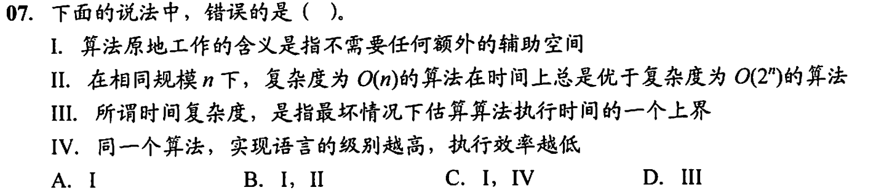

A，辅助空间为常量

# 线性表

## 定义

相同数据类型的有限序列，线性有序的一种逻辑结构

## ADT 操作

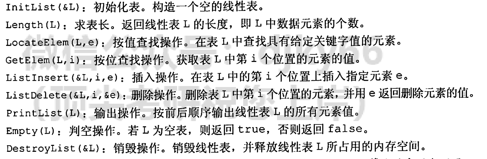

[题目](题目 782a88aafaa14186bb7e860541de1d2b.md)

## 顺序表（线性表的顺序存储结构）

### 一些定义和特点

1. 逻辑顺序与物理顺序相同
2. 随机存取的存储结构，随机访问，由表头地址和下标查找元素只需O(1)
3. 存储密度高，每个结点只有数据元素
4. 增删需要移动大量元素

### 数组

静态

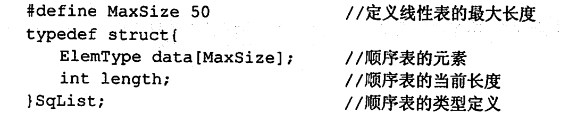

动态

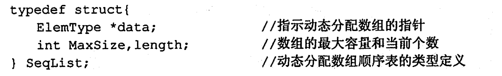

动态分配也不是链式存储，还是顺序存储结构

### 基本操作

1. 插入
    
    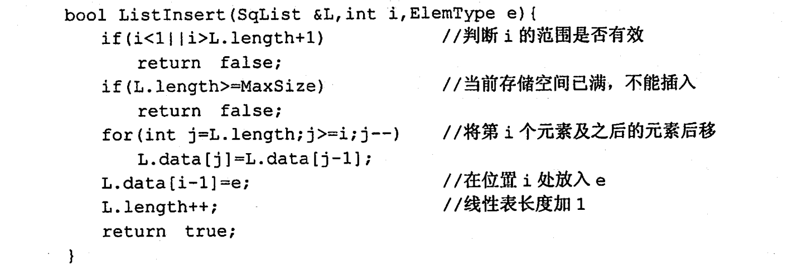
    
    <aside>
    ⚠️ 注意区别顺序表位置和数组下标，有的位置用了length+1
    
    </aside>
    
    时间复杂度：
    最好表尾O(1)，最差表头O(2),平均O(n)（$p_i=1/(n+1)$）：
    
    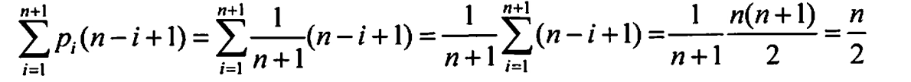
    
2. 删除
    
    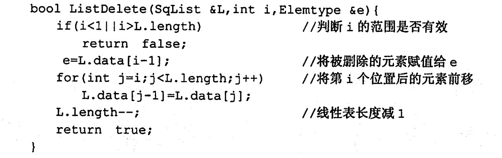
    
    时间复杂度：
    最好表尾O(1)，最差表头O(n)，平均O(n)($p_i=1/n$):
    
    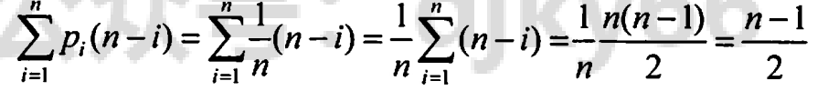
    
3. 查找
    
    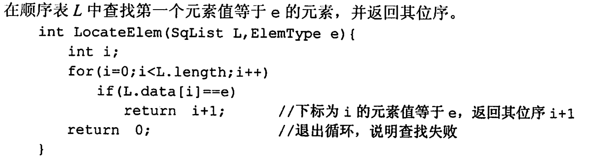
    
    时间复杂度：
    最好表头O(1)，最差表尾（或不存在）O(n)，平均O(n)($p_i=1/n$):
    
    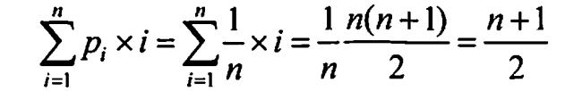
    

[题目](题目 4fa03496953947d8892eb24d134fd82c.md)

## 链表（线性表的链式存储结构）

1. 存储单元无需连续，逻辑相邻无需物理位置相邻
2. 增删不需要移动元素
3. 不可随机存取

### 单链表

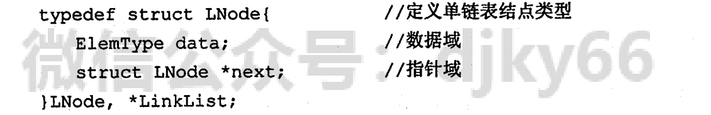

**优缺点：**

1. 非随机存取，某个结点需从表头开始遍历。
2. 浪费指针域存储空间
3. 不需要大量连续存储单元（除静态链表）

**头结点：**

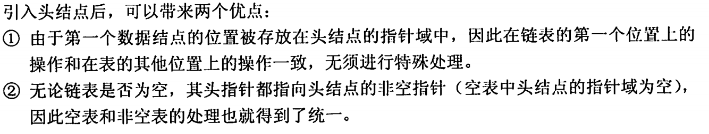

**基本操作及时间复杂度：**

### 双链表

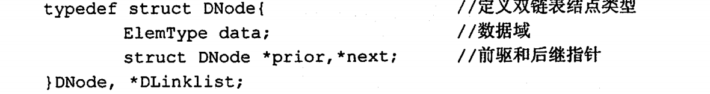

**优缺点**：

1. 插入删除本身操作只需O(1)（包括尾结点），查找还是要遍历
2. 主要提升是直接访问前驱结点只需O(1)

**基本操作：**

### 循环链表

**循环单链表：**

（这玩意到底有没有 head？）

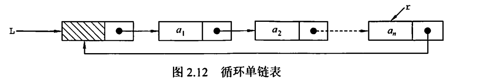

1. 尾结点指向头结点
2. 判空是头结点指针等于头指针
3. 设尾指针替代头指针，r→next就是头指针，对表头表尾操作只需O(1)

**循环双链表：**

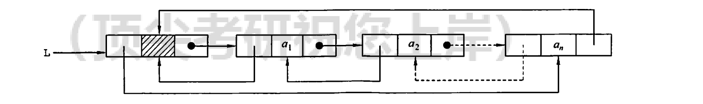

1. 判空头节点的 prior 和 next 都为头指针

### 静态链表

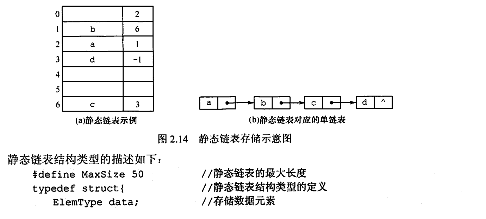

next == -1 结束

[题目](题目 3731afee99414eba852fe2a020fade00.md)

### 判断链表是否成环

快慢指针

# 栈

## 顺序栈

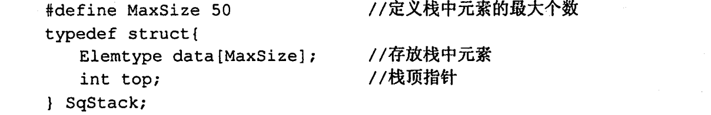

### 基本操作

<aside>
⚠️ 如果 `[S.top](http://S.top)`初始化为-1，则`S.data[++S.top]=x` 是入栈，`S.data[S.top--]= x` 是出栈。如果 `S.top` 初始化为 0，则`S.data[S.top++]=x` 是入栈，`S.data[--S.top]` 是出栈

</aside>

<aside>
😮 在 C++ 和其他类似的编程语言中，`++top` 和 `top++` 表示的是对变量 `top` 的增量操作，但它们的行为略有不同。这两种形式分别被称为前缀增量（`++top`）和后缀增量（`top++`）。它们的主要区别在于操作的顺序和返回值。

1. **前缀增量（`++top`）**:
    - 首先将 `top` 的值增加 1。
    - 然后返回 `top` 增加后的新值。
    
    举例来说，如果 `top` 的初始值是 5，执行 `++top` 后，`top` 变为 6，并且表达式 `++top` 的值也是 6。
    
2. **后缀增量（`top++`）**:
    - 首先记住 `top` 当前的值。
    - 然后将 `top` 的值增加 1。
    - 最后返回 `top` 增加前的原始值。
    
    例如，如果 `top` 的初始值是 5，执行 `top++` 后，`top` 变为 6，但表达式 `top++` 的值是 5。
    

这种差异在循环或赋值操作中尤为重要。例如，在 `for` 循环中使用这些操作时，选择使用前缀增量还是后缀增量可能会影响循环的性能，尤其是在处理大型数据结构时。通常，前缀增量（`++top`）在性能上略优于后缀增量（`top++`），因为后者需要存储一个额外的临时变量来保存原始值。

</aside>

### 共享栈

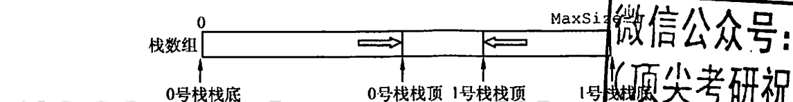

top0=-1时 0号栈为空，top1=maxsize时 1 号栈为空，栈满时相邻(top1-top0=1)

## 链栈

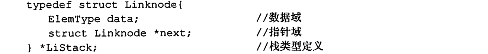

## 栈的应用

### 括号匹配

### 中缀转后缀

1. **创建一个栈**：用于存储操作符。
2. **遍历中缀表达式**：从左到右遍历表达式的每个字符。
3. **处理操作数**：如果字符是操作数（数字或变量），直接将其添加到后缀表达式中。
4. **处理操作符**：
    - 如果栈为空或栈顶元素为左括号`(`，则将操作符压入栈。
    - 如果遇到右括号`)`，则从栈中弹出元素并添加到后缀表达式中，直到遇到左括号`(`。不要将这对括号添加到后缀表达式中。
    - 如果当前操作符的优先级高于栈顶操作符的优先级，将其压入栈。
    - 否则，从栈中弹出元素并添加到后缀表达式中，直到栈为空或遇到一个优先级更低的操作符。然后将当前操作符压入栈。
5. **遍历完成后**：如果栈中还有操作符，依次弹出并添加到后缀表达式中。

### 递归

[题目](题目 0b1c8314247a472f8eeb460f683ca1d8.md)

# 队列

## 基本操作

## 顺序存储

### 普通队列

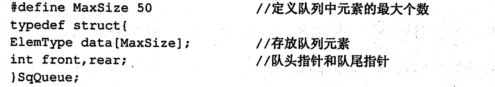

初始状态：`Q.front=Q.rear=0`

进队操作：`x=Q.data[Q.rear++]`

出队操作：`x=Q.data[Q.front++]`

`Q.rear==MaxSize` 不可作为队列满条件，如 d，假溢出

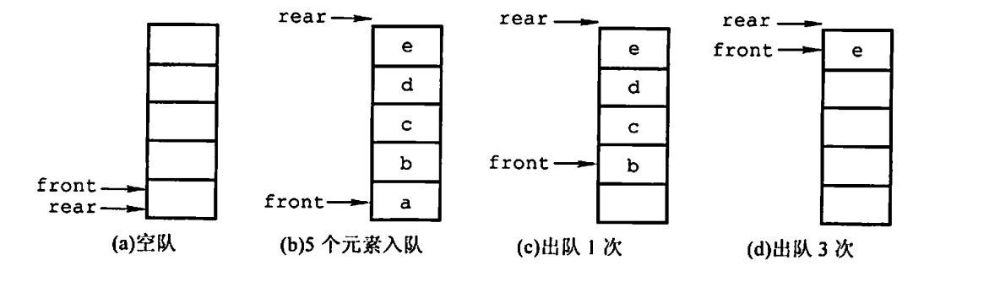

### 循环队列

通过取余运算来实现（把++变成下面这些）

初始状态：`Q.front=Q.rear=0`
队首指针进 1：`Q.front=(Q.front+1)%MaxSize`
队尾指针进 1：`Q.rear=(Q.rear+1)%MaxSize`
队列长度：`(Q.rear-Q.front+MaxSize)%MaxSize`
队列空：`Q.rear==Q.front`

牺牲一个单元来区分队空和队满

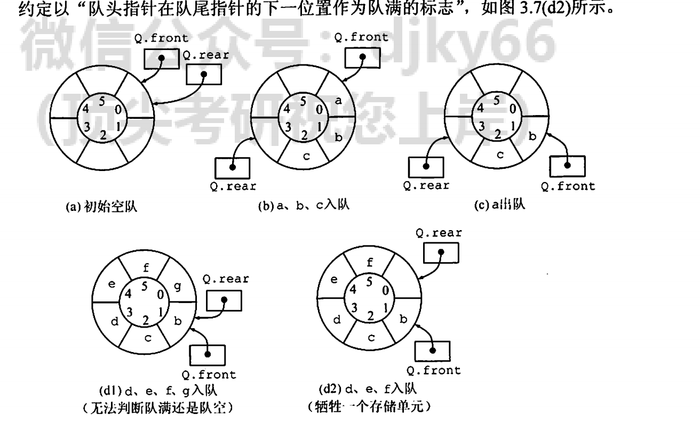

队列满：`(Q.rear+1)%Maxsize==Q.front`

## 链式存储

不怕溢出，适合元素变动比较大的情况

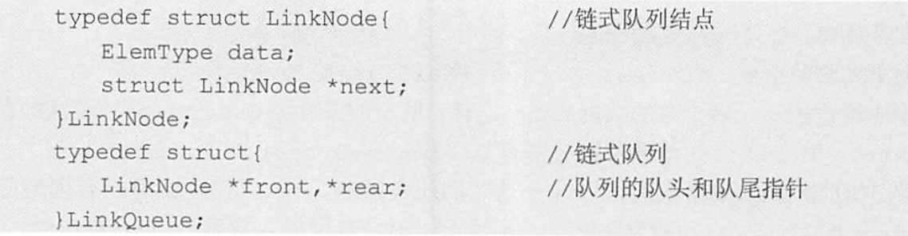

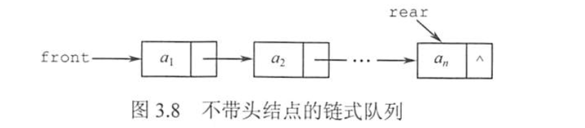

<aside>
⚠️ 队列中的尾指针指向尾结点，这点与顺序存储不同（指向尾结点下一个位置）

</aside>

队列空：`Q.front == NULL && Q.rear == NULL`
出队：`Q.front` 指向下一个结点。如果是最后一个元素，那么front和rear都 NULL
入队：新建结点并`Q.rear` 指向新结点，如果原来队空，那么 front 也指向它

这样操作不统一，因此采用带头节点的单链表

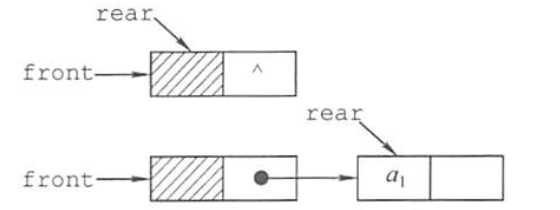

队列空：`Q.front == Q.rear`
出队：`Q.front` 指向下一个结点。如果是最后一个元素，那么front和rear也是相同，指向头结点
入队：新建结点并`Q.rear`指向新结点

## 双端队列

输入受限的：一端能插入，一端不能插入

输出受限的：一端能删除，一端不能删除

两个都受限的：某端点插入的只能从该端点删除，变为栈底相接的栈

## 队列应用

缓冲区，层序遍历（下一章）

[题目](题目 2b2a2772d43f4e09912b5cced62bb00b.md)

# 特殊矩阵

## 对称矩阵

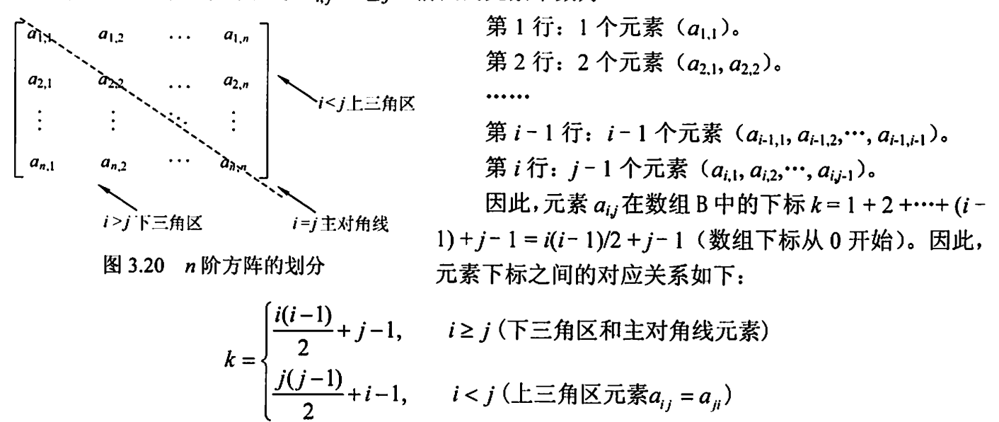

下三角按行优先，上三角按列优先，具体明白下怎么转换的

## 三角矩阵

按数组下标从 0 开始。如要求首结点空，则从 1 开始具体分析

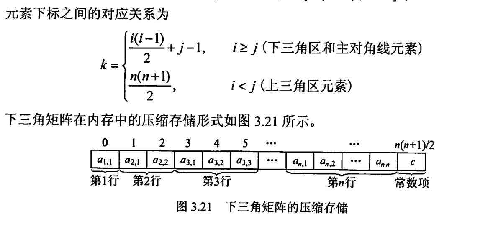

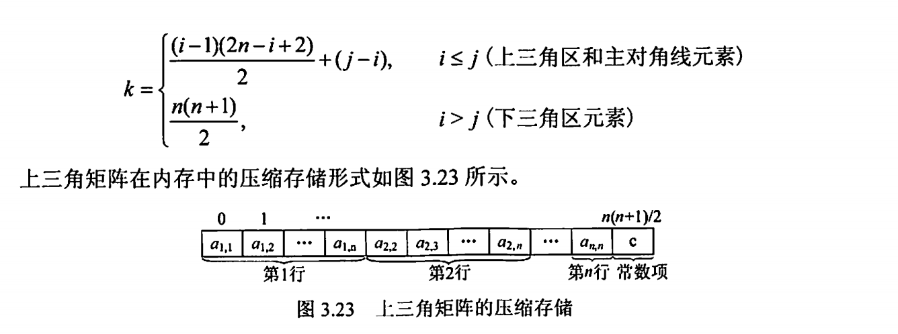

## 三对角矩阵

懂原理就行，会算数一切不是问题。首尾行（首尾列）有两个元素，剩下为三个元素。

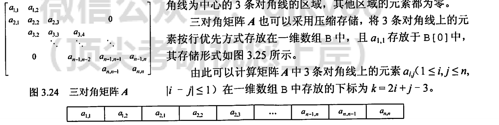

## 稀疏矩阵

变为三元组，但会失去随机存取特性。

可以用三元数组或十字链表

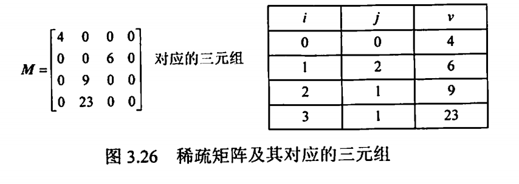

[题目](题目 2797429a883842e98f6084e0080551eb.md)

# 串

串用顺序存储或链式存储

重点在于 KMP next 数组的求解，不同的人next 方法不一样，这边用学校的

无脑求解next 和 nextval

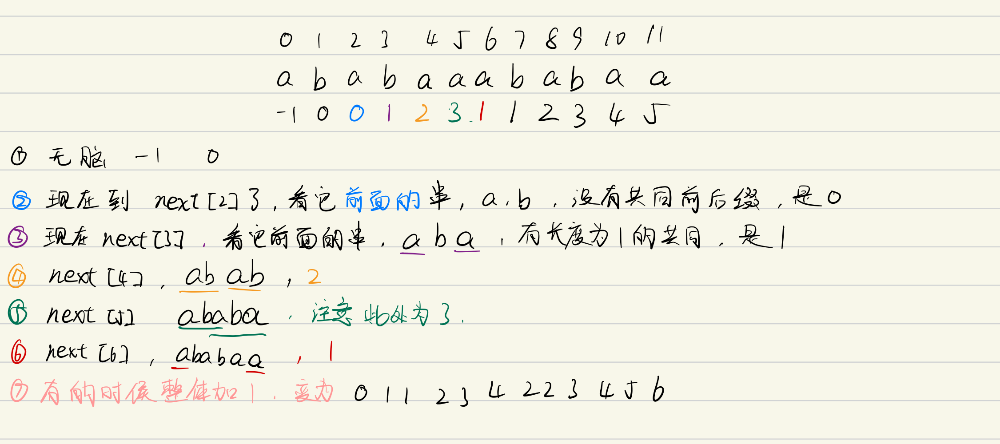

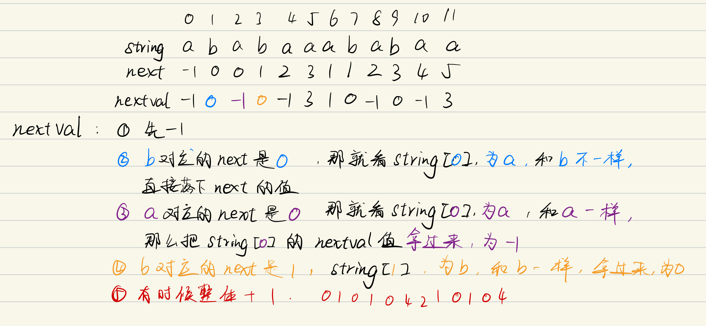

模式串移动匹配问题见题目：

[题目](题目 cc31d14c2eb949c2a0e1f2a129caec29.md)

# 树

## 树的概念和性质

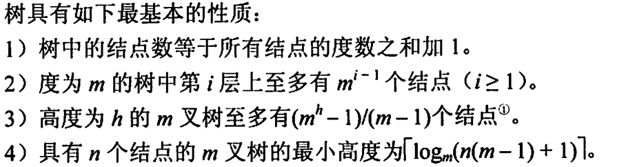

[题目](题目 552b767fa32f4366afe6de00d26c9b0e.md)

## 二叉树

每个结点最多有两个子树，有左右次序之分。

### 顺序存储

完全和满二叉树比较适合，一般二叉树不适合，需要用元素表示大量空结点

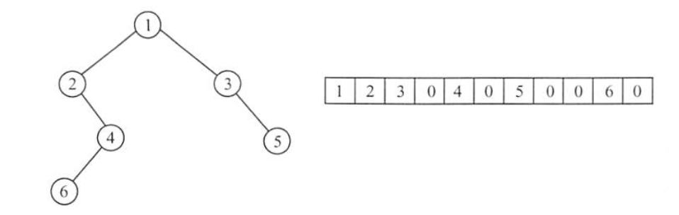

<aside>
⚠️ 如果考试有写这种程序的，建议从数组下标 1 开始存，要不有的性质用不了，怎么算都是 0 了

</aside>

### 链式存储

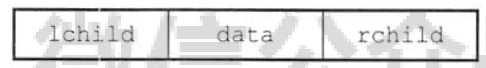

可以拓展为三叉链表，至少三个域。

该二叉链表有n+1个空链域

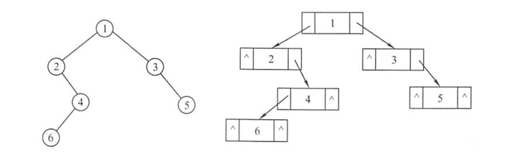

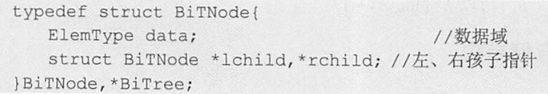

### 共有性质（非空）：

1. 叶子数等于度为 2 的结点数+1，$n_0+n_1+n_2=n_1+2n_2+1$
2. 第 k 层上至多有$2^{k-1}$个结点，就是度为 2 的树
3. 高度为 h，至多有$2^h-1$个结点

### 满二叉树

1. 高度为 h，则结点数为$2^h-1$
2. 除叶子结点其他顶点度均为 2
3. 按层序编号，结点i 的父结点为\[i/2\]，左孩子为 2i，右孩子 2i+1
4. 满二叉树是特殊的完全二叉树，继承其性质

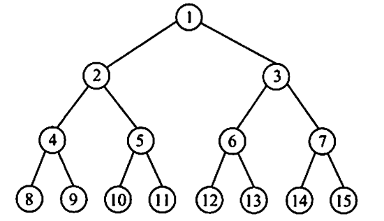

### 完全二叉树

其实就是满二叉树少了最右下面的一部分

1. 层序编号，$i\le[n/2]$，i 为分支结点，否则为叶子结点
2. 叶子结点只可能在层次最大的两层出现，且靠左排列。
3. 如果一个结点度为1，那么它只可能有左孩子而没有右孩子
4. 若出现某个结点只有左孩子或为叶子，则其后面的结点均为叶子结点
5. 若n为奇数，则每个分支结点都有左右孩子（可能有叶子结点，因此不是满二叉树）；若 n 为偶数，则编号最大的分支结点（即 \[n/2\]）只有左孩子，无右孩子（如图），其之前的均有左右孩子

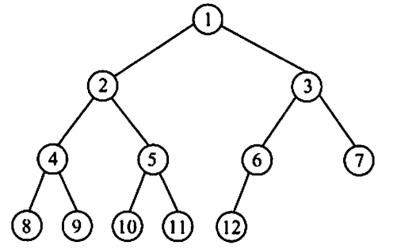

1. 结点 $i$所在层次（深度）为
$[log_2i]+1$
2. n 个结点的完全二叉树高度为$[log_2(n+1)]$或$[log_2n]+1$

[证明](证明 dfdf7b57a161488a9a286d99e9da38dc.md)

### 排序二叉树

左子树关键字均小于根节点，右子树关键字均大于根节点

### 平衡二叉树

任一结点的左子树与右子树深度之差不超过 1

[题目](题目 6f8b90cbd5aa4bd4a46d425643c09b01.md)

## 二叉树遍历

先中后层，算法得知道怎么写

[二叉树遍历算法](二叉树遍历算法 50aab28ffb9e4bdcba6c2e059fd631ff.md)

[题目](题目 74e1f1e6a5b6437d822f3319b269cbc1.md)

## 线索二叉树

[题目](题目 d12e7bff89ea48fdbbf5f25db6977edd.md)

## 树的存储结构

### 双亲表示

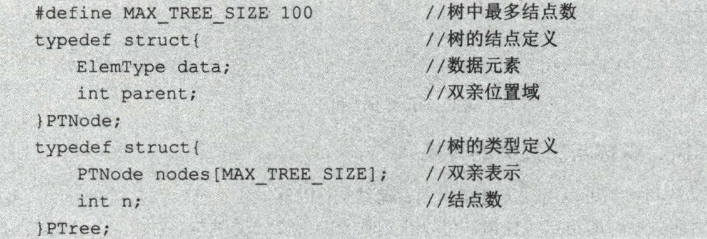

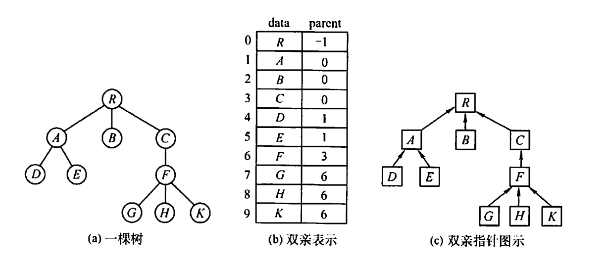

### 孩子表示法

每个节点的孩子用单链表表示

寻找子女容易，找双亲需要所有的链表都遍历才知道孩子的双亲是谁

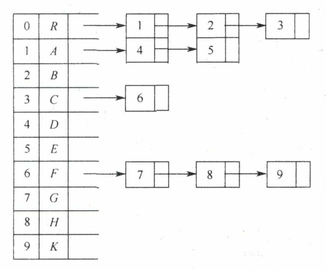

### 孩子兄弟表示法

每个节点有三部分：结点值，第一个孩子和下一个兄弟，用于转换为二叉树

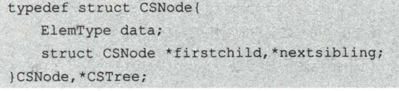

查找孩子容易，找双亲需要遍历

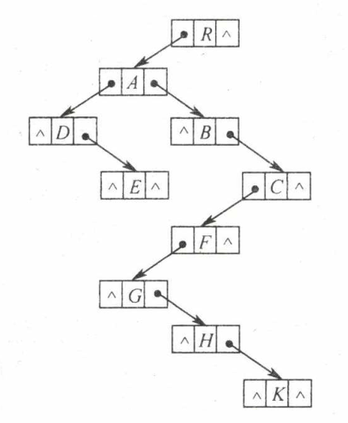

## 树、森林、二叉树转换

**树和二叉树**

左孩子右兄弟规则

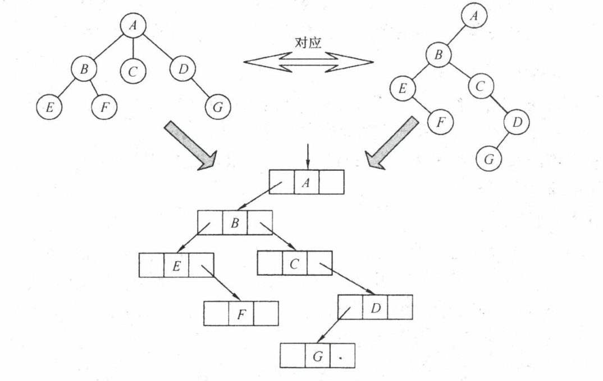

**森林和二叉树**

先把树转化为二叉树，再将根节点连为二叉树，还是左孩子右兄弟

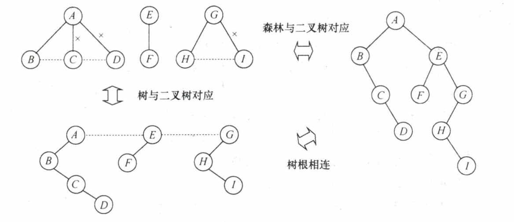

## 树和森林遍历

### 树

1. 先根遍历：先访问根节点，再进入子树，序列与其转化为的二叉树的先序序列相同，ABEFCDG
2. 后根遍历：先进入根节点的每棵子树，然后在看根节点，与转化后的二叉树的中序序列相同，EFBCGDA

### 森林

1. 先序遍历森林：访问森林第一棵树的根节点，然后先序遍历其子树，再遍历下一棵树，ABCDEFGHI
2. 中序遍历森林：先先序遍历第一棵树的子树，然后访问其根节点，再遍历其他树BCDAFEHIG

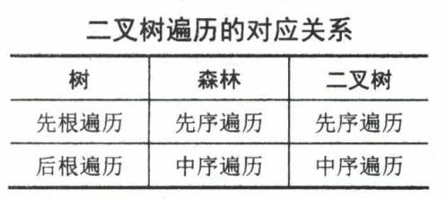

[题目](题目 28c75b82542c42a4bacae799bde3599a.md)

## 哈夫曼树

[题目](题目 39aba94ddb4045659159e167cb7dc8da.md)

## 并查集

求解等价类

[题目](题目 659bcc2fbabc4618b313b1faf0e15f99.md)

## 堆

# 图

## 图的概念性质

1. 有向图：有方向，狐尾狐头
2. 无向图：连着就行，没有箭头
3. 简单图：不存在重复边和自身到自身的边
4. 完全图：在简单图前提下，无向图边满了（n(n-1)/2），有向图不仅满还都双向（n(n-1)）
5. 子图：顶点是子集，边也是子集。生成子图是点还是那些点，边少了
6. 连通图：无向图中任意两个顶点有路径。如果 n 个顶点小于n-1条边，那么非连通。连通分量是极大连通子图，可以有多个连通分量，极大连通子图要包含所有的边

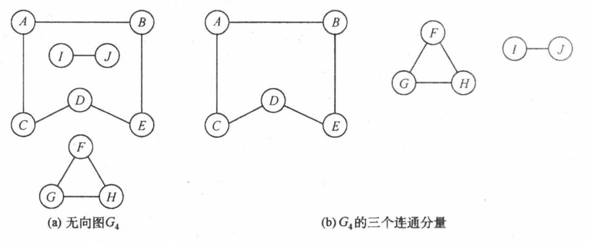

1. 强连通图：有向图的概念上，加上双向路径（不是弧）才是强连通，最少要有 n 条边

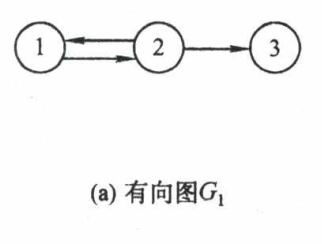

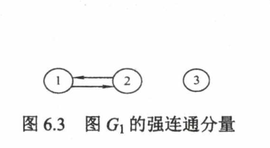

1. 生成树：连通图的生成树是极小连通子图，包含原来的所有顶点，且边最少的情况下连通。非连通图中生成树构成生成森林
2. 度：无向图是度，全部顶点度和为边数 2 倍。有向图是入度出度，入度出度和相等都等于边数
3. 权：边权，带权图是网
4. 稠密图稀疏图：相对而言
5. 路径：顶点序列
6. 回路：第一个顶点和最后一个顶点相同。n 个顶点有大于 n-1 条边，则有环
7. 简单路径：顶点不重复。简单回路：除首尾顶点，其他无重复
8. 距离：有最短路径的长度。没有路径的话就是无穷
9. 有向树：一个顶点入度为 0，其他顶点入度均为 1 的有向图

[题目](题目 b3d17e618bdf4bafaa20287c16a5a668.md)

## 图的存储

### 邻接矩阵

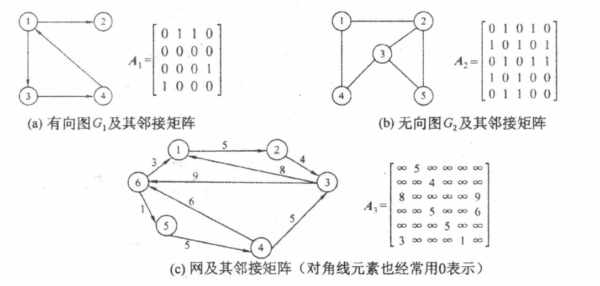

1. 无向图邻接矩阵第 $i$行的非零元素个数是顶点 $i$的度；有向图行是出度，列是入度
2. 空间复杂度$O(n^2)$，n 为顶点数；无向图邻接矩阵是对称矩阵，可以[压缩](%E6%95%B0%E6%8D%AE%E7%BB%93%E6%9E%84%E4%B8%8E%E7%AE%97%E6%B3%95%20dc82eb78903d4bd093174a6a60aabbe7.md)
3. 容易确定两顶点之间是否有边，若要确定有多少条边，需要全部遍历
4. 稠密图适合用邻接矩阵

### 邻接表

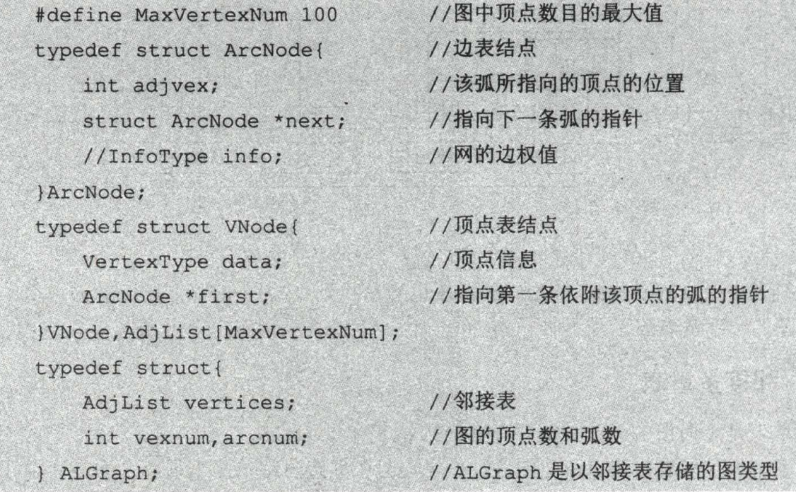

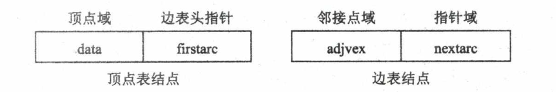

就是指顶点表，指向第一条边，边表是所有该顶点的边

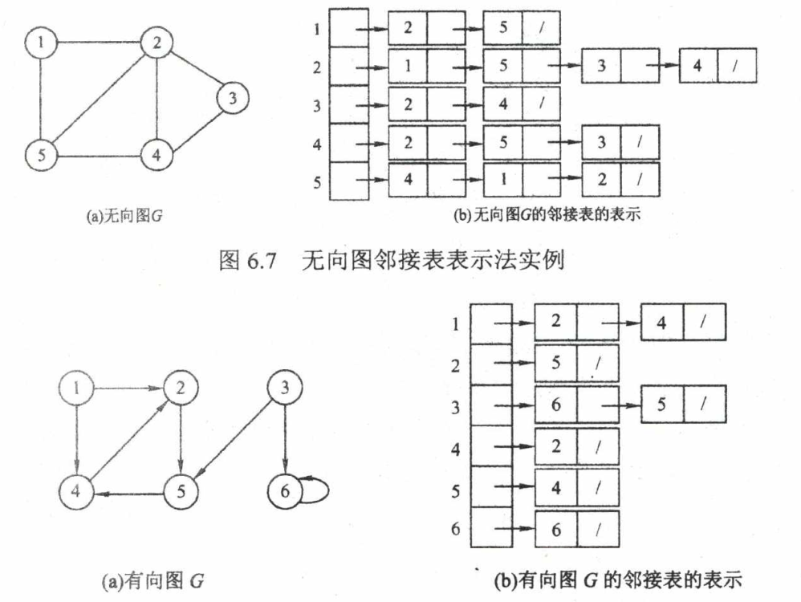

1. 适合存储稀疏图
2. 无向图空间复杂度为O(V+2E)，每条边出现了两次；有向图是O(V+E)
3. 与邻接矩阵相比，找邻接边很容易（矩阵则需要遍历一行O(n)）；但两个顶点是否有边没有邻接矩阵快
4. 有向图的邻接表求某个顶点出度只需要走一遍，但入度需要全部遍历；可以用逆邻接表求入度
5. 邻接表不唯一，边的次序任意

### 十字链表（有向图）

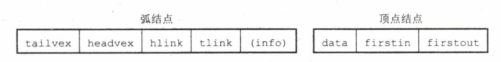

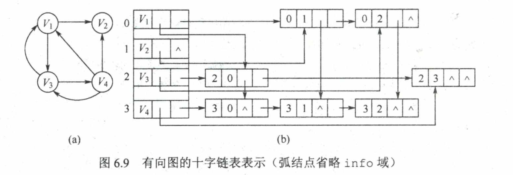

弧头是入，弧尾是出

原理：有个顶点结点， firstin 指向以它为弧头的一条弧，firstout 指向以它为弧尾的一条弧
这条弧上有弧头弧尾结点，hlink 指向弧头相同的下一条弧（都插入它的弧），tlink 指向弧尾相同的下一条弧（都往外射的弧）

1. 顶点结点之间顺序存储
2. 求出度入度都很容易
3. 图的十字链表 不是唯一的，但是能确定一个图

### 邻接多重表（无向图）

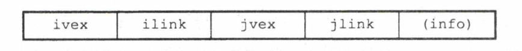

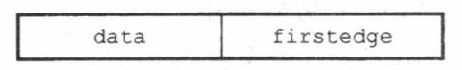

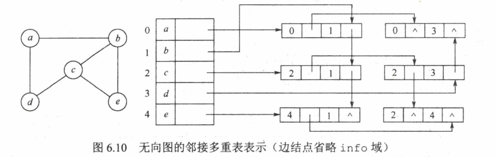

原理类似于十字链表，不需要区分首尾

与**邻接表**的区别，邻接表每个边需要两个结点，而这个只需要一个结点

## 图的基本操作

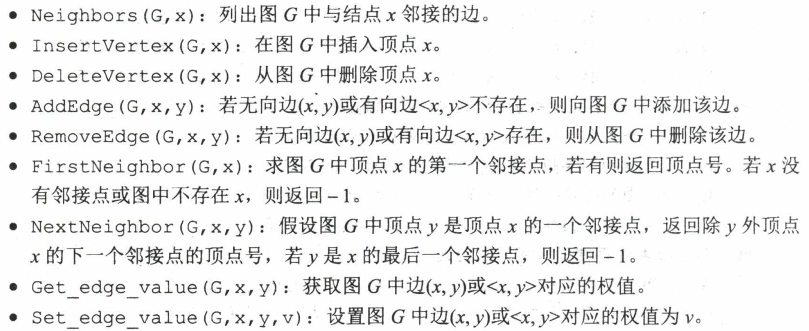

[题目](题目 25b98965f14f4ab0857d73fdc9e1ac04.md)

## 图的遍历

### 广度优先搜索 BFS

[BFS代码](BFS代码 7448d42803da42b689e4bde6377e3879.md)

主要思想：从起始点开始，遍历它的所有邻接点，遍历到时访问并加入队列，标记已访问。在遍历其邻接点之前，出队列。

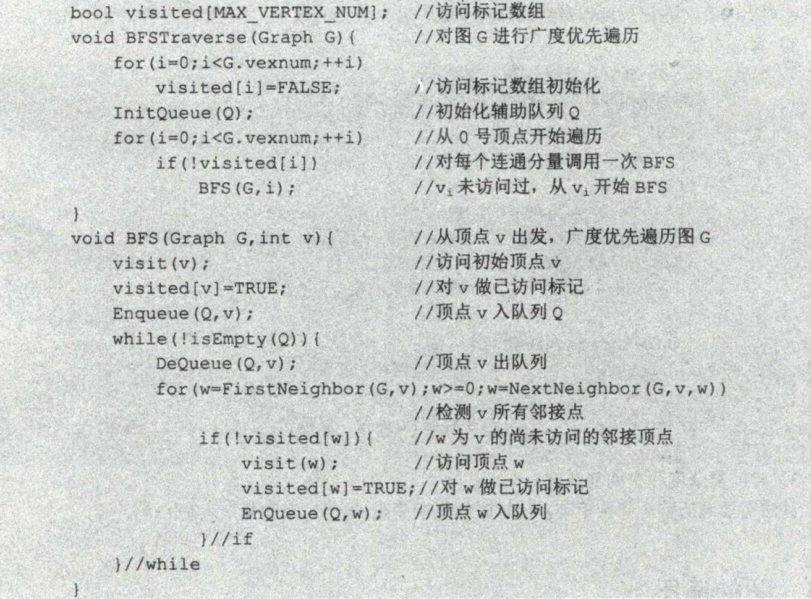

<aside>
💬 为什么BFS和 DFS算法在BFSTraverse（）中加入了第二个 for 循环？这是为了防止图是非连通的，一次无法全部访问。因此可以用来判断是否连通

</aside>

**空间复杂度**：需要借助队列，最差为O(｜V｜）

**时间复杂度**：

1. 邻接表：需要遍历每个顶点，$O(|V|)$，还需要遍历每一条边$O(|E|)$，则$O(|V|+|E|)$（并列都要进行，加法）
2. 邻接矩阵：对于每个结点，都要遍历这一行，即剩下$|V|-1$个结点是否邻接$O(|V|)$，所有结点都要遍历，则$O(|V|^2)$

**单源最短路径：**

可以求解非带权图的，加个距离矩阵就行，

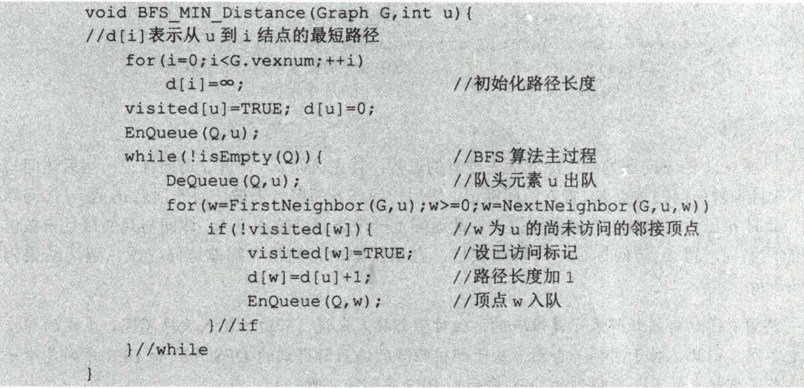

到 u 的距离在上一次循环中得到，那么这次它的邻接点 w 的距离则是到 u 的距离+1

**广度优先生成树**

也就是遍历过程中是有顺序的进入下个结点，这个过程会生成一棵树

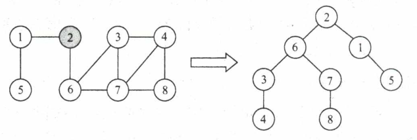

## 深度优先搜索 DFS

主要思想：从初始点开始，先找第一个邻接点，对它进行 DFS（这里是递归），然后等这个递归结束了，再进行下一个邻接点，就是在这地方实现了返回到之前访问过的顶点。同时也要设计标记数组。

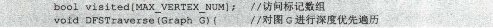

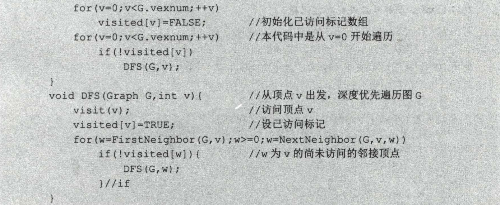

**空间复杂度**：递归算法需要用栈$O(|V|)$

**时间复杂度**：同 BFS

**深度优先生成树和森林：**

连通图才是一棵树

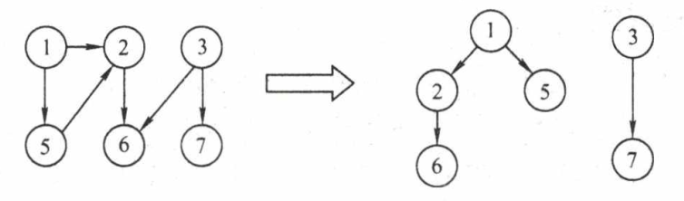

DFS 可用来判断是否有回路。如果从 v 开始 DFS，则在 DFS（v）中的递归结束返回之前，若出现某个顶点到 v 的回边，则有回路（环）

<aside>
⚠️ 邻接表表示不唯一，因此采用邻接表时相同的图会对应不同的 DFS
 和 BFS，以及生成树

</aside>

[题目](题目 8ed3e04d93f243a78ea069ee3023e9e1.md)

# 图的应用

## 最小生成树

### Prim

### Kruskal

## 拓补排序

## 关键路径

## 最短路径

### Dijkstra

### Floyd

[题目](题目 2b4181a8865048ea9326ba59e4dc47a2.md)

# 查找

## 顺序查找

### 一般顺序查找

线性表逆序查找，第一位（下标是 0）放哨兵，这样的好处是不用判断，当查找到 key 时直接返回当前下标（或指针）就行。

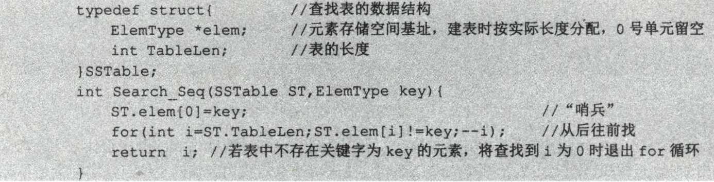

它的 ASL 为平均成功查找长度，定位到第 i 个元素需要进行（计数原理）n-i+1

$$
ASL_{成功}=\sum_{i=1}^nP_i(n-i+1)
$$

 假设每个元素查找概率相同，则 $p_i=\frac{1}{n}$

$$
ASL=\frac{n+1}{2}
$$

### 有序表顺序查找

引入判定树来进行计算，虚构失败结点

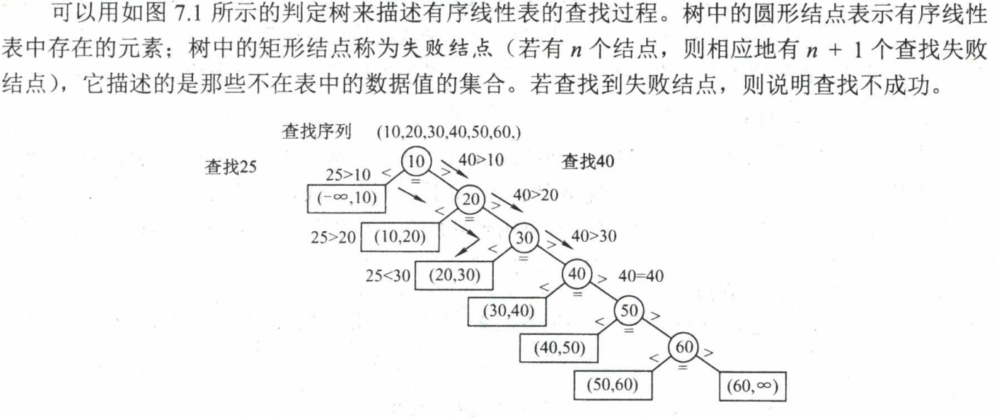

计算成功 ASL 的方法与一般线性表一致，失败的 ASL 借助失败结点来计算，共有 n+1 个失败结点,$l_j$是第 j 个失败结点所在层数，-1 是因为实际查找到失败结点的长度其实是与它相连的圆形顶点，在上一层

$$
ASL_{不成功}=\sum_{j=1}^nq_j(l_j-1)
$$

假设概率相同，则$q_i=\frac{1}{n+1}$

$$
ASL=\frac{1}{n+1}(1+2+...+n+n)=\frac{n}{2}+\frac{n}{n+1}
$$

## 折半查找

取中间，设置最左边界和最右边界，比较，然后更新左边界或右边界

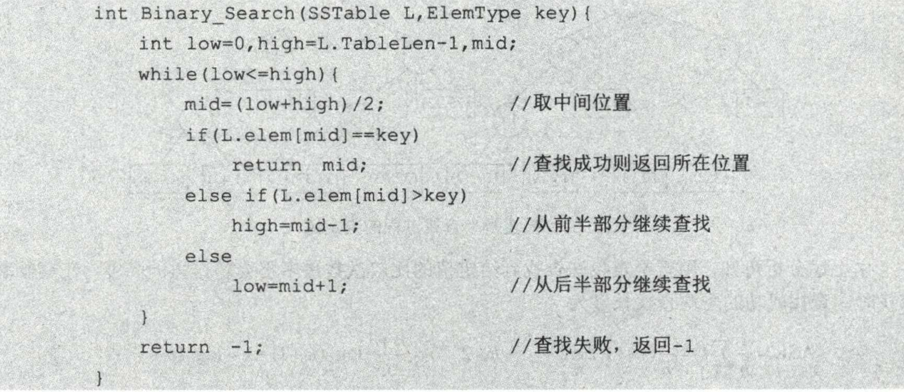

构建判定树，左子树小于结点，右子树大于结点

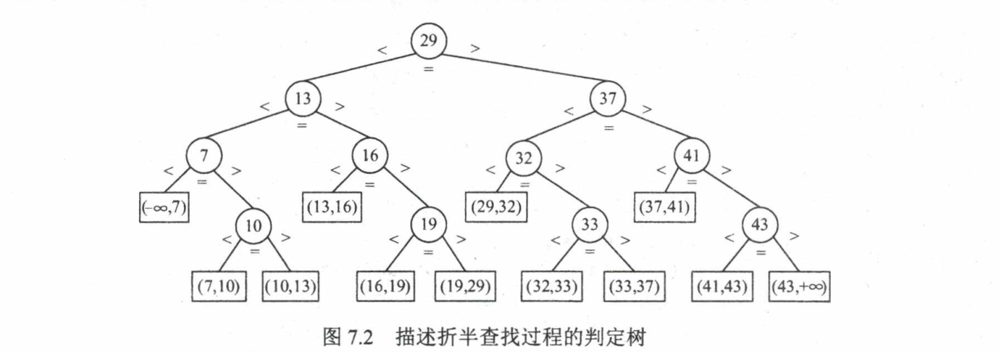

查找成功：

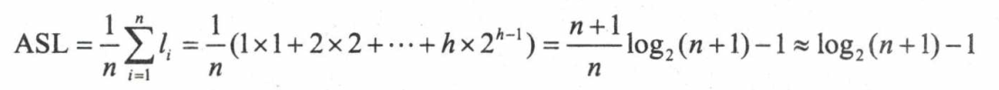

因此，可以得到时间复杂度为$O(log_2n)$

失败结点的个数：$n_0=n_2+1$

## 分块查找

每块长度为$\sqrt n$，索引表中有每个分区最大值和其对应的下标

ASL：

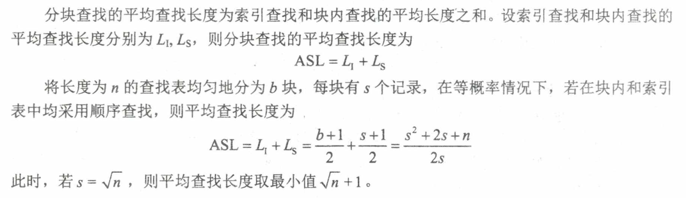

[题目](题目 ef1acc27d5094e1c8b37127ec4510030.md)

# 树型查找

## BST

1. 左子树小于根节点，右子树大于根节点
2. 中序遍历能得到递增有序序列，123468
3. BST更适合动态查找表（插入删除）；二分查找适合静态查找表，采用顺序表存储

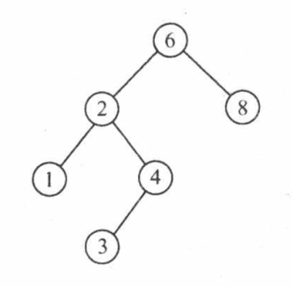

### 查找

小找左，大找右

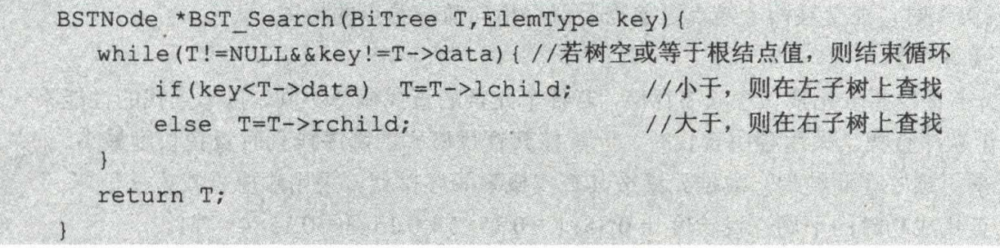

**时间复杂度：**

1. 若情况好，树平衡，则取决于树的高度，$O(log_2n)$, 和二分查找一样
2. 情况差，单支树，$O(n)$
3. BST 插入删除是$O(log_2n)$，而二分查找是$O(n)$

### 插入

递归插入，也是小找左，大找右，直到当前子树（结点）为空，插入元素

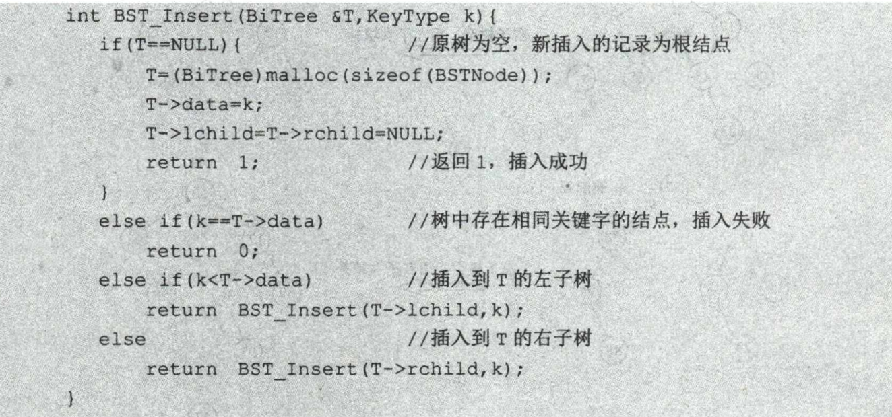

### 构造

按输入的序列顺序构造，小左右大，用的插入的算法

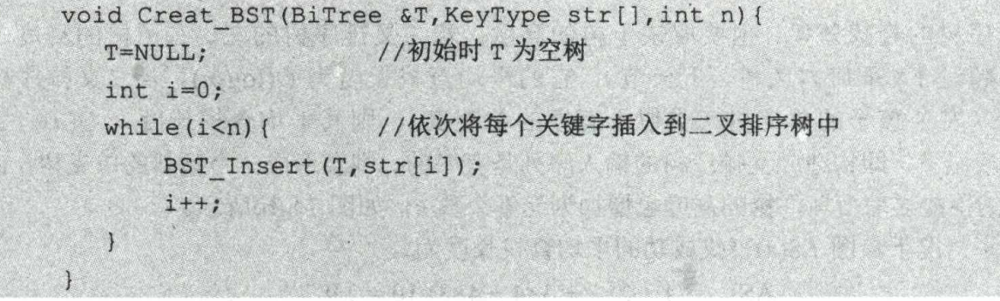

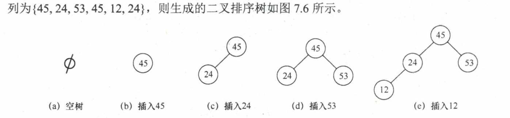

### 删除

有三种情况，第三种需要找一个满足左大右小的元素，也就是中序排序中它后面的结点替代它，然后将替代它的元素从原位置删除

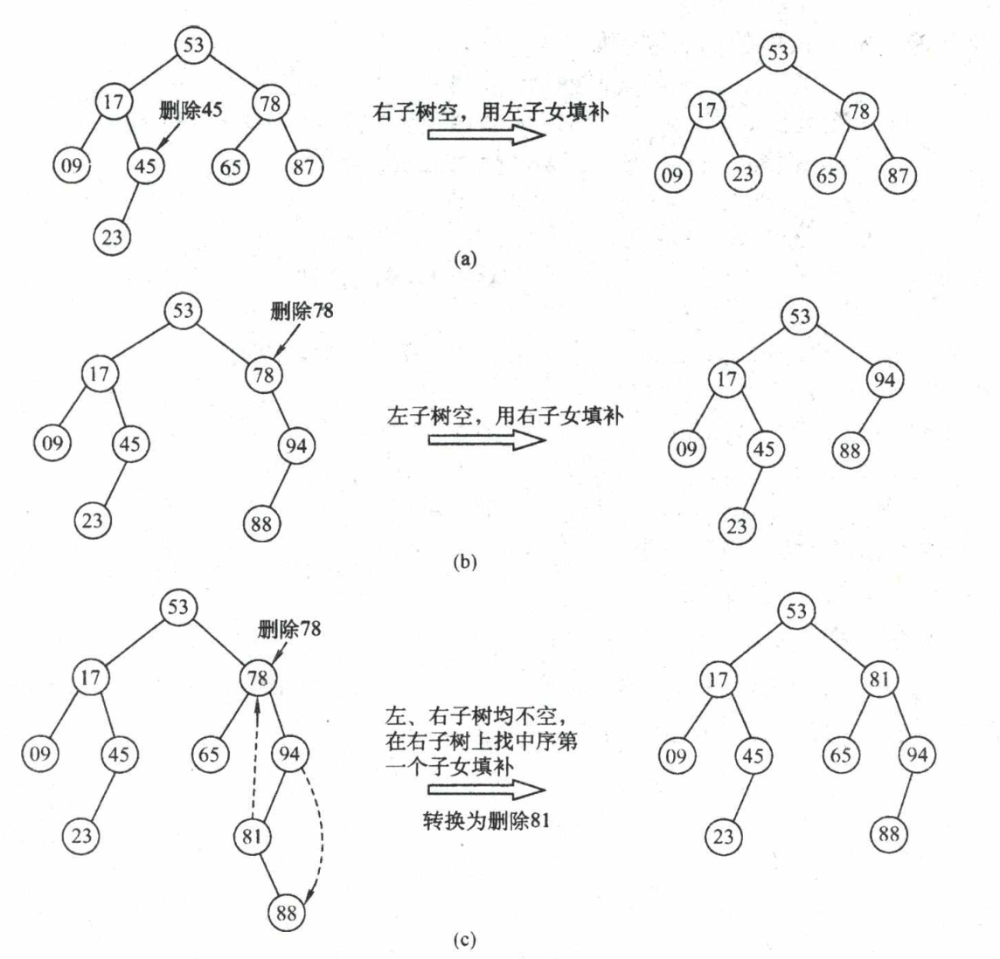

## 平衡二叉树

### 插入

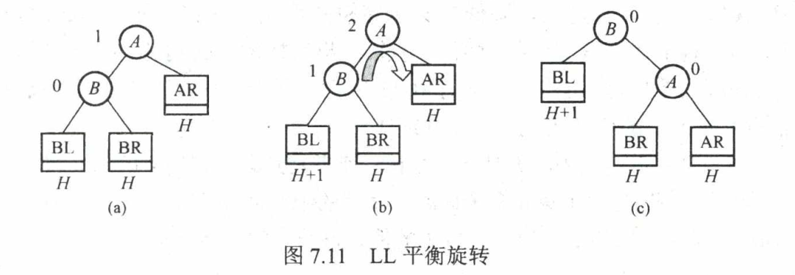

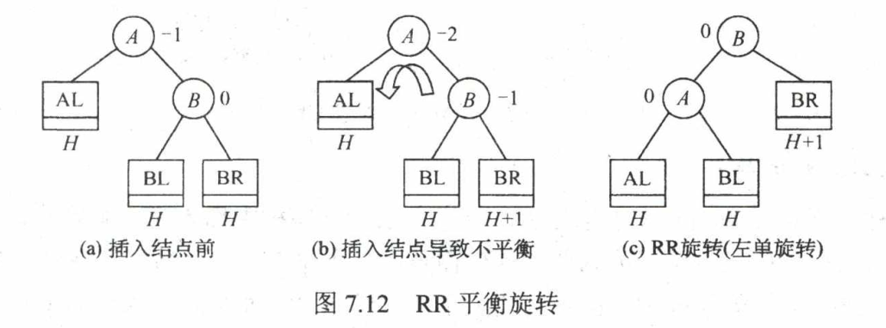

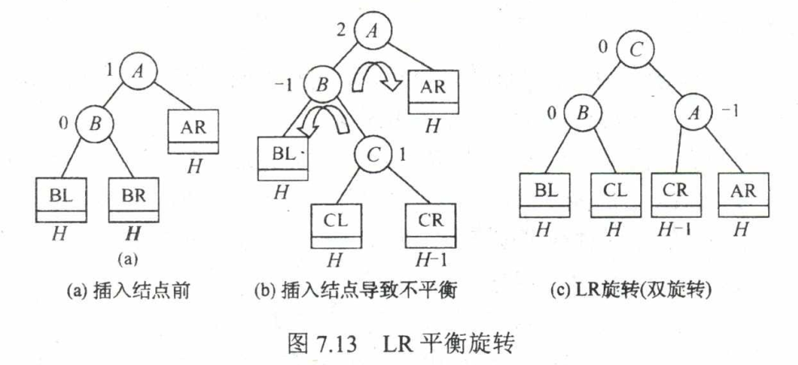

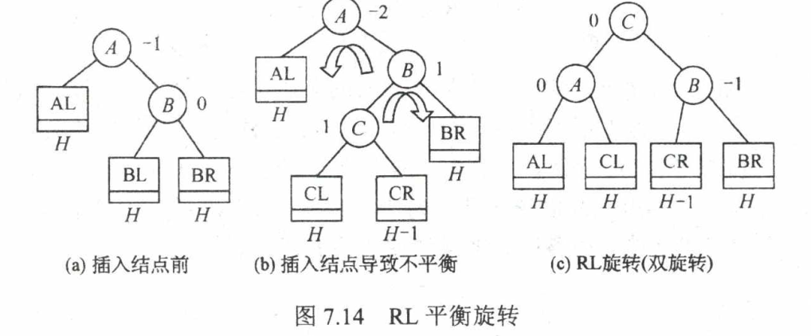

### 删除

先进行和 BST 一样的删除操作，然后再判断 y 和 x，

### 查找

最多比较次数

深度为 h 的平衡树含有的最少结点数？比如，T3 是新加个结点把前两棵树连起来，以此类推，得出数目

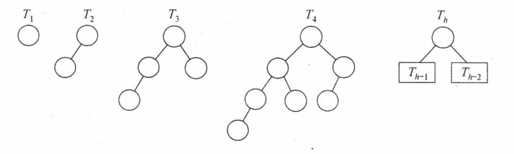

## B 树

是一棵 m 路查找树，可以为空

1. 结点子树个数=该节点关键字数+1
2. 失败结点个数=总关键字数+1
3. 子树：除根和叶子（失败），结点至少有$\lceil m/2\rceil$～$m$棵，根是 $2$～$m$
4. 结点关键字数：非失败结点（除根）的为$\lceil m/2\rceil-1$～$m-1$，根是 $1$～$m-1$
5. 总关键字个数：$2(\lceil m-2\rceil)^{h-1}-1\le N\le m^h-1$
6. 高度： $log_m(N+1)\le h\le log_{\lceil m/2\rceil}(\frac {N+1}{2})+1$
7. 所有终端结点和叶子结点（失败结点）都位于同一层
8. 每个结点关键字达到最少，高度最大
9. 提高阶数 m 来降低高度，从而减少读磁盘次数

### 查找

先找到结点（BST），再找到结点内关键字（顺序或折半）

成功所需时间为关键字所在层，失败取决于树高

### 插入

先查找到他应该插入的结点，然后如果插入后关键字个数大于 m-1，结点分裂；如果这种操作导致父结点也冒了，有可能要重复操作一直传至根结点

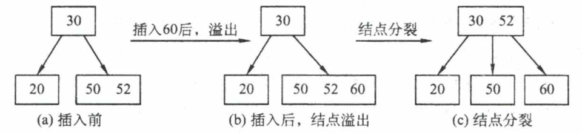

### 删除

如果删除的结点（80）不在终端结点，直接用前驱（78）替代，然后转化为删除终端结点（78）的问题

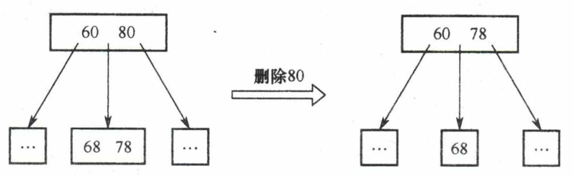

**删除终端结点**

1. 删除前关键字$\ge\lceil m/2\rceil$，直接删
2. 删除前关键字$=\lceil m/2\rceil -1$，且有够用的相邻左右兄弟（$\ge\lceil m/2\rceil$），则把兄弟换上去作为双亲，双亲换下来替代删除结点
3. 兄弟也不够用，删除后把双亲和兄弟合并为新结点。合并后双亲结点关键字数会-1。如果该双亲节点不是根节点，且关键字数少于要求，则还要往上重复这个操作直到符合要求

## B+树

1. 每个分支结点最多有 m 棵树
2. 根节点（非空）至少有两棵子树，其他的至少有$\lceil m/2\rceil$棵子树
3. 结点子树个数=关键字个数
4. 叶结点不是失败结点，是全部的关键字
5. 叶结点互相连接
6. 每个分支结点（除根）关键字字数为$\lceil m/2\rceil$～$m$
7. 非叶结点是索引作用，叠起来就是索引套索引，一直索引到对应的叶子结点
8. 非叶结点中的关键字对应 下一层每个子树的最大关键字
9. 可实现从最小关键字开始的顺序查找和根节点的多路查找
10. 无论成功与否，查找路径都为树的高度，也就是从根查到叶子

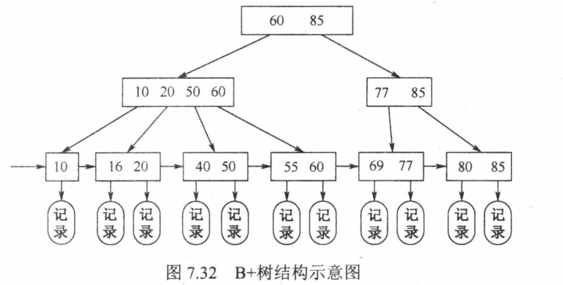

### 差异

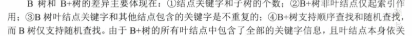

[题目](题目 03e26af35279492497034c26b63fa928.md)